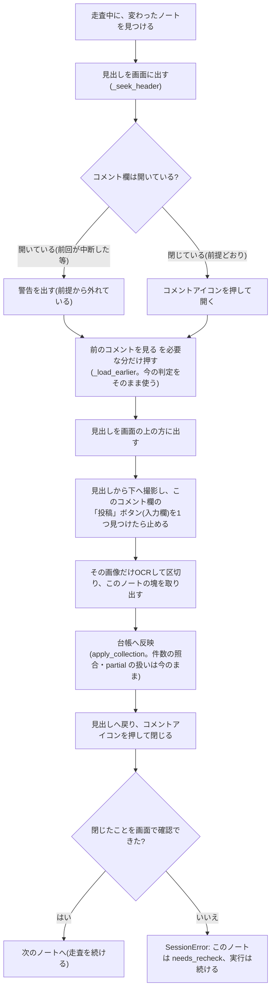

# オプチャ読み取り 方式変更の設計（一括撮影 → ノートごとに読んで閉じる）

- 状態: 実装済み（2026-09-29。提案どおり、一括方式は残さず置き換え、開いたまま残っていたら警告して閉じる）
- 対象: `collector/line_openchat/`（`session.py`・`threadread.py`・`tests/sim.py`）。Worker・スキーマ・APIの変更なし
- 関連: [chikirin-openchat.md](chikirin-openchat.md)（現行の仕様）、[openchat-capture-design.md](openchat-capture-design.md)（画素でつなぐ撮影の設計）

## 1. 目的

1. **前提「コメント欄は閉じた状態から始まる」を、collector 自身が守る。** 今は開いたコメント欄を閉じずに終わるため、次の実行で開いたまま残っていることがあり、それが原因の不具合が続いた（別ノートの「前のコメントを見る」の取り違え、撮影の止まる位置のずれ、撮り直し。#185〜#187）。読んだらその場で閉じれば、この種類の不具合は仕組みとして起きなくなる。
2. **全体を短くする。** 一覧が長いまま走査しない。走査のあとの「先頭に戻って撮り直す」工程（②）を無くす。

速くなるかは実測で確かめる（§8）。速さより 1. を優先する。

## 2. 今の方式と、変えたあと

| | 今（一括撮影） | 変えたあと（ノートごと） |
|---|---|---|
| ①走査で変わったノートを見つけたら | 開いて、「前のコメントを見る」を必要な分押し、**開いたまま**次へ | 開いて、必要な分押し、**その場で撮影・OCR・台帳へ反映し、閉じて**次へ |
| コメントを読むタイミング | 走査がすべて終わってから、一覧の先頭から撮り直して1回でOCR | ノートを開くたびに、そのコメント欄だけを撮影・OCR |
| 撮影の範囲 | 一覧の先頭〜最後に開いたコメント欄の終わり（途中の変化のないノートも含む） | そのノートの見出し〜そのコメント欄の終わり |
| 終わったときのコメント欄 | 開いたまま | すべて閉じている |
| ちきりんの判定 | 変わらない（読んだコメントを全件台帳に記録し、その中で投稿者を判定。件数の照合と重複判定に全件が必要） | 同じ |

直近の実機（2026-09-29 14:12、`--dry-run`、7件を開いた）の内訳: 全体357秒 = ①走査231秒 + ②126秒（準備30・撮影31・OCR53・区切り12）。変えたあとは②が無くなり、代わりに「ノートごとの撮影・OCR」と「閉じる往復」が①に入る。

## 3. 1件のノートの流れ（変えたあと）

### 3.1 撮影（G）
- 撮影は今と同じ `capture.scan_down`（画素でつなぐ）を、**一覧の先頭からではなく、このノートの見出しが見えている位置から**始める。始める前に、見出しが帯（固定見出しの下）に完全に入るよう位置を整える。
- 止める条件は今の `EndCounter` を目標1で使う（このコメント欄の入力欄の「投稿」ボタンを1つ数えたら止める）。撮影はこのノートの見出しから下へ進むので、**最初に見つかる「投稿」ボタンは必ずこのコメント欄の終わり**になる（ほかのコメント欄が開いていても、それはこのコメント欄より下にある）。今の方式で起きた「別のコメント欄の入力欄も数えて、手前で止まる」問題は起きない。
- 倍率などの調整（`calibrate`）は、今と同じく実行の最初に1回だけ行う。

### 3.2 読み取り（H）
- つないだ画像を今と同じ `tallocr.ocr_tall` → `tallparse.parse_tall` → `group_notes` で読み、**このノートに当たる塊を1つ**取り出す（`_match_group`）。見出しの上下に写った他のノートの塊は使わない。
- 塊が見つからない、または表示件数が1件以上なのにコメントが0件に見えるときは、撮影をやり直す（1回まで）。それでもだめなら `needs_recheck`。

### 3.3 台帳への反映（I）
- 今の `_capture_pending` の中身（件数の更新、`partial` と `truncated` の突き合わせ、本文の補完）を、ノート1件ぶんの処理として切り出してそのまま使う。**件数の照合のルールは変えない。**

### 3.4 閉じる（J・K）
- 撮影を止めた位置はコメント欄の終わり。見出しまで上へ戻り（`_seek_header`）、コメントアイコンを押す。押すのは今も使っている `toggle_comments`（`safety.guard_click` の許可の範囲内。新しい種類のクリックは増えない）。
- 押したあと、見出しの直下がコメント・「前のコメントを見る」・入力欄でないこと（`_is_open` が False）を画面で確かめる。確かめられなければ `SessionError`（そのノートは `needs_recheck`、実行は続ける）。
- 閉じると一覧が縮むので、走査は今と同じく「画面が変わったので撮り直す」で続ける。

## 4. 前提が崩れていたとき（開いたまま残っているコメント欄）

前回の実行が途中で中断された（マウス操作など）と、コメント欄が1つ開いたまま残ることがある。
- **変わったノートで、すでに開いていた**: 警告を出したうえで、そのまま読み（押す必要なし）、最後に閉じる。
- **変わっていないノートで、開いていた**: 警告を出して閉じる（読まない）。一覧を短く保ち、次の実行を前提どおりの状態から始めるため。
- 警告の文言: 「開いたまま残っていたコメント欄を閉じました（前回の実行が途中で止まった可能性があります）」。前提が崩れていたことが、実行のたびにログで分かる。

## 5. 消すもの（今の方式でだけ必要だったもの）

- `_capture_pending` の一括撮影、撮影の早期停止の数え方（`_threads_open` を目標にする部分）、途中で止めたときの撮り直し（#187）
- `_apply_unvisited`（一括撮影に写り込んだ、走査で完全に見えなかったノートの扱い）。ノートごとの撮影では、走査で完全に見えたノートしか扱わない。走査で完全に見えなかったノートは、スクロールが進めば完全に見える（今の `_advance` が画面の重なりを保証している）。
- `run()` の段階②（「コメント欄を撮影・読み取りします」）。ログの段階表示は ①のみになる（ノートごとに「撮影中」「OCR」「閉じました」を出す）。

残すもの: `_load_earlier` とその判定（`_thread_region`・`_already_read`・`_full_expand_required`）、件数の照合（`apply_collection` の `partial`）、`split_blocks` の合体検出、数字の見本照合、進捗ログ。

## 6. 途中で止まったとき

| 止まった場所 | 何が残るか | 次の実行 |
|---|---|---|
| 開いた直後〜撮影中（操作を検知して中断） | そのノートのコメント欄が開いたまま。台帳は未反映 | §4 のとおり警告して読み直し、閉じる |
| 台帳へ反映した後、閉じる前 | 同上（台帳は反映済み） | 変わっていなければ警告して閉じるだけ |
| 閉じたことを確認できない | 同上 | 同上 |

中断されても、台帳は1件ずつ保存する（今の `checkpoint` を反映の直後に呼ぶ）ので、読み終えたノートの分は失われない。

## 7. テスト方針

- **前提をテストで明示する**: シミュレーターの実行後に「すべてのコメント欄が閉じている」ことを、主要なテストで確かめる。今までテストが毎回ウィンドウを閉じ直していて、実機との差に気づけなかった反省から、「閉じ直さずに2回続けて実行しても、閉じた状態から始まる」ことをテストする。
- シミュレーター（`SimThreadReader`）に、「見出しから、このコメント欄の終わりまで」を撮る読み取りを追加する（今の `read_all` は文書全体を撮る）。
- 追加するテスト:
  - 変わったノートを読んだあと、コメント欄が閉じていること。走査が1件も飛ばさないこと。
  - 前回が中断してコメント欄が開いたまま残っていたら、警告して閉じること（変わったノート・変わっていないノートの両方）。
  - 撮影で塊が見つからない・コメント0件に見えるとき、1回撮り直し、だめなら `needs_recheck` になること。
  - 閉じたことを確認できないとき、`needs_recheck` にして実行を続けること。
  - 「前のコメントを見る」の既読判定・`partial` の件数照合が、今と同じ結果になること（今のテストをそのまま通す）。
- `tests/test_safety.py`（押せる操作の種類）が変更なしで通ること。

## 8. 確認の手順

1. pytest 全件。
2. 実機、**本来の手順**（ノートを開き直してから）で `--dry-run`。警告0・走査の飛ばし0・台帳の件数一致を確認し、終了後にすべてのコメント欄が閉じていることを画面で確認する。
3. 所要時間を今の方式（直近357秒、7件を開いた回）と比べる。同程度の件数を開く回で比べる。
4. 問題なければPR。

## 9. 決めていただきたいこと

1. **切り戻しの方法**: 今の一括方式を、しばらく `--batch-capture` のような指定で残すか、残さずに置き換えるか（戻すときは `git revert`）。残すと、2つの方式を両方テストし続ける必要がある。**提案: 残さずに置き換える。**
2. **開いたまま残っていたときの扱い**（§4）: 警告して閉じる、でよいか。代わりに「実行を止めて、開き直してもらう」こともできる。**提案: 警告して閉じる（止めると、中断のたびに手作業が要る）。**
3. **速くならなかった場合**: 実測で今より遅かったとしても、前提を守れる利点を優先して採用するか。**提案: 大きく遅くならない限り採用する。**
